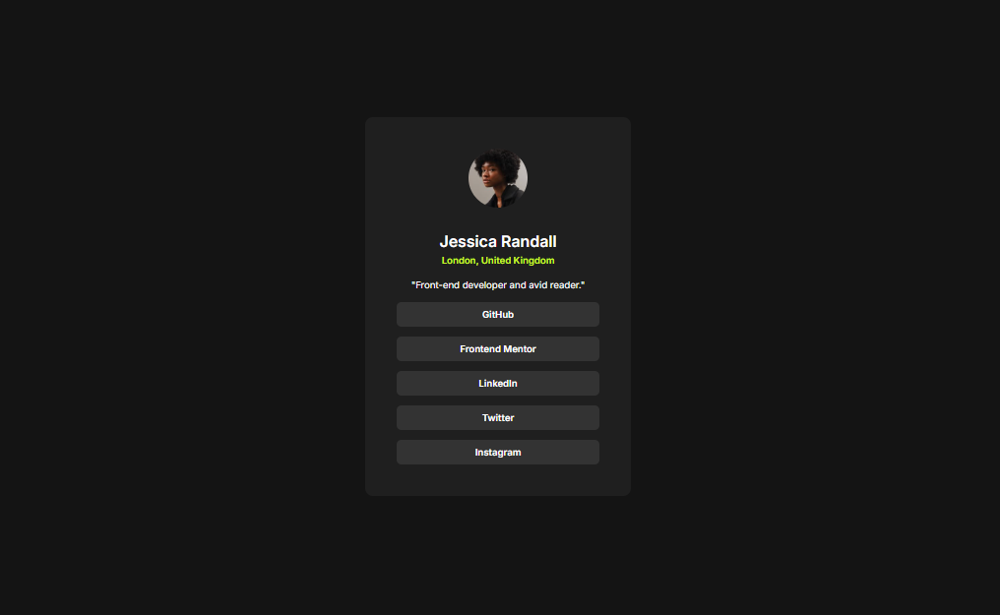

# Frontend Mentor - Social links profile solution

This is a solution to the [Social links profile challenge on Frontend Mentor](https://www.frontendmentor.io/challenges/social-links-profile-UG32l9m6dQ). Frontend Mentor challenges help you improve your coding skills by building realistic projects. 

## Table of contents
- [The challenge](#the-challenge)
- [Screenshot](#screenshot)
- [Links](#links)

### The challenge

Users should be able to:

- See hover and focus states for all interactive elements on the page

### Screenshot

### Links

- [Live Site URL](https://adil-solkar.github.io/social-links-profile-main-frontendmentor-challenge/)

## Author

- Frontend Mentor - [Adil-Solkar](https://www.frontendmentor.io/profile/Adil-Solkar)
